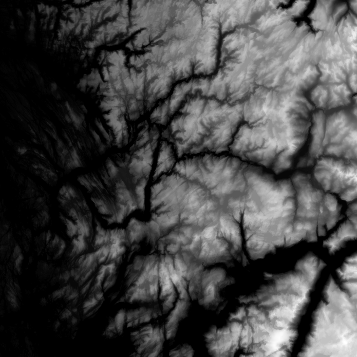

# Digital Elevation Model to Depth Map

A script for rendering a depth map from a given digital elevation model (DEM).

## Example

Using a DEM for the southern parts of the Vestland region in Norway, which can be downloaded for free from [GeoNorge](https://kartkatalog.geonorge.no/nedlasting):


The actual DEM looks like this (almost completely black) when being used, the example above has been hillshaded for making it easier to see what the map is actually containing:



In `main.py` I have specified that the coordinates I want to use as viewpoint is `60.36458, 5.32426`, which is the pair of latitude and longitude for the Løvstakken mountain in Bergen. Knowing that these coordinates are inside the bounds of the DEM, I can run the script with the downloaded DEM as an argument. This results in a generated PNG which contains the generated panorama image, looking like this:


After applying a Canny Edge Detection algorithm we get an image showing the contours of the mountains:


## Example for normal rendering without coloring by depth

Modifying the `pov.py` file by removing `thetexture` and adding this block of code:

```
light_source { CAMERALOOKAT color White }
sphere{<0,0,0>,1 hollow
    texture{
    pigment{gradient <0,1,0>
            color_map{
            [0.0 color rgb<0.9 0.9 0.9>]
            [0.5 color rgb<0.1,0.25,0.75>]
            [1.0 color rgb<0.1,0.25,0.75>] }
            } // end pigment
    finish {ambient 1 diffuse 0}
    } // end of texture
    scale 10000
    }
```

and adding pigment to the `height_field`:

```
pigment {
            gradient y
            color_map {
                [0.0 color SlateBlue]
                [0.003 color BakersChoc]
                [0.02 color White]
                [1 color SlateBlue]
            }
        }
```

it will result in a colored 3D rendering of the DEM, which is this case looks like this:


